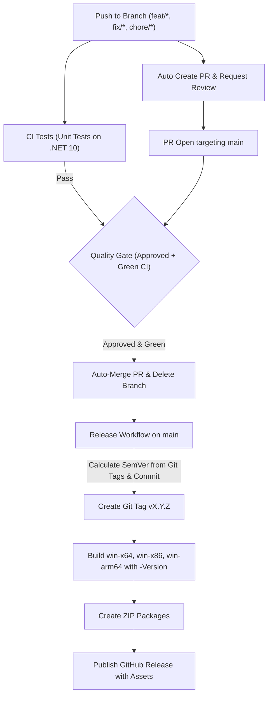

# Mic Helper

Network microphone status indicator.

Minimalistic lightweight portable extremely low resource consumption system tray client-server application to indicate microphone mute status information from remote PC.

As a gameplay streamer I often forgot that my microphone was muted during stream due to some circumstances and I'm continuing to stream with muted microphone for some time (some times pretty long time). This application helps to avoid this situation by providing an overlay that indicates the microphone mute status over the game window. Application designed as client-server model so you can even see microphone mute status from multiple PCs (for example if it's connected to separate streaming PC).

<p align="center">
  
</p>

Download latest release from [Releases](https://github.com/mercdev-corp/mic-helper/releases) page for your platform. Unzip the archive.

Run MicHelper.Server.exe on PC where mic is plugged in. Open settings and select desired microphone device (change other options if needed).


Run MicHelper.Client.exe on PC where you want to see the microphone mute status. Open settings and select your server from dropdown (change other options if needed). Drag and drop and resize the overlay as needed.


Seetings for each part will be saved in same folder wrom where application is executed.

## Architecture

.NET native application

### Server

Running on a PC with microphone plugged in. Subscribes to microphone mute status changes and broadcasts them to connected clients.

### Client

Running on a remote PC. Subscribes to microphone mute status changes from the server and updates the system tray icon and overlay accordingly.

# UI

System tray application on both server and client. As a system tray icon, it displays the microphone mute status and have context menu with items:
- Pause/Resume
- Settings
- Exit

## Server application

Server application broadcasts microphone mute status changes to connected clients via UDP multicast and updates tray icon accordingly.

### System Tray Statuses

Server side system tray icon displays next statuses:

- Paused (server in paused state and not broadcasts mic statuses)
- Disconnected (in case of target device is not found on PC, i.e. mic is not plugged in)
- Microphone muted
- Microphone unmuted

### Menu

Using context menu on tray icon you can achieve the following actions:

#### Pause/Resume

Pauses and resumes the microphone status broadcasting. On pause all connected clients will be disconnected. State is saved to settings and applied immediately.

#### Settings

Opens settings dialog. Settings saved and applied on change and on server start. If dialog closed application continues running. Settings saving on change in same directory as the application in `mic-helper-server-settings.json`.

Settings options:

##### Run on startup

Enables or disables the application to run on startup.

Works as simple adding/removing from startup applications list. State is get by checking if the application with the current path is in the list of startup applications.

##### Microphone selection

Default to system's default microphone on first run, save it in settings.

Dropdown list of available microphones. Shows selected microphone from settings as current selection. Updates settings on selection change.

In case of microphone from settings not found it will show the as first available microphone from the list as red strikethrough text and all existing microfones following it. If microphone selection not changed manually - it will remain in settings despite not being found in the system.

##### Retry timeout

Defaults to `5` seconds.

Integer input field to adjust retry timeout in seconds.

##### Port number

Defaults to `13205`

Integer input field to adjust port number where the server broadcasts mic statuses. On change saved to settings and applied immediately.

Displays in red if port is already in use by another application. If port is already in use, shows tooltip `Port is already in use` on hover.

#### Exit

Exits the application.

### Behavior

If server is in paused state, server will not check microphone status and will drop all connected clients. Also it'll show `paused` status icon in system tray.

If server is not in paused state, server will watch for selected microphone status (by subscribing to microphone events if it's available, or checking it periodically) and broadcast statuses to connected clients according to following rules:
- Server check only selected microphone's status when it's plugged in. If microphone is not available, server will show `device disconnected` status icon in system tray and drop all connected clients until microphone becomes available again. Server checks if microphone is becoming available periodically according to retry timeout settings.
- If microphone is muted, server will broadcast `muted` status to all connected clients and show `microphone muted` status icon in system tray.
- If microphone is unmuted, server will broadcast `unmuted` status to all connected clients and show `microphone unmuted` status icon in system tray.

## Client application

Consumes application microphone statuses from the server and updates transparent clickthrough , overlay and system tray icon accordingly.

### System Tray Statuses

Client side system tray icon displays next statuses:

- Paused (application in paused state and  not consuming mic statuses)
- Disconnected (can't connect to server)
- Microphone muted
- Microphone unmuted

### Menu

Using context menu on tray icon you can achieve the following actions:

#### Pause/Resume

Pauses and resumes consuming the microphone statuses. State is saved to settings and applied immediately.

#### Settings

Opens settings dialog as movable window. Settings saved and applied on change and on client start. If dialog closed application continues running. Settings saving on change in same directory as the application in `mic-helper-client-settings.json`.

When settings dialog is opened - the overlay `microphone muted` becomes visible in WYSIWYG edit mode with a dashed outline, 4 corner resize handles, and a real-time size badge. User can drag and drop the overlay to position it anywhere on screen, and resize it with aspect ratio locked using:
- **Mouse Wheel:** Scroll up/down anywhere over the overlay to smoothly enlarge or shrink it.
- **Corner Handles:** Click and drag any of the 4 corner handles (or bottom-right diagonal grip).
- **Settings Slider:** Directly adjust the **Overlay size** slider in the Settings dialog.

Each position change of the image's geometry center and dimensions will be stored and applied immediately. Resized versions of images (which will be displayed as overlay, such as `microphone muted` and `server disconnected`) will be pre-rendered and cached to disk on save to ensure zero CPU/GPU overhead during runtime.

Settings options:

##### Run on startup

Enables or disables the application to run on startup.

Works as simple adding/removing from startup applications list. State is get by checking if the application with the current path is in the list of startup applications.

##### Port number

Defaults to `13205`

Integer input field to adjust port number where the server broadcasts mic statuses. On change saved to settings and applied immediately.

##### Server IP

Dropdown list of serve's IP addresses which is currently broadcasts in local network on selected port.

Defaults to first available IP address from the list and saved to settings.

If not provided, application will show `disconnected` status icon and will not try to connect to the server. On change saved to settings and applied immediately.

If IP address not found/not accessible in local network it will show IP from settings as selected first option but with red strikethrough text and other available servers' IP addresses following it. If IP selection not changed manually - it will remain in settings despite not being found in the local network.

##### Retry timeout

Defaults to `5` seconds.

Integer input field to adjust retry timeout in seconds.

##### Overlay opacity

Defaults to `100`.

Slider to adjust maximum opacity of the overlay from `0` to `100`.

Overlay will pulse from `0` to this setting and back to `0` according top `Pulse frequency` setting.

##### Pulse frequency

Defaults to `1`.

Slider to adjust pulse frequency of the overlay from `.1` to `5` seconds.

##### Overlay size

Defaults to `128` pixels (adjustable from `32` to `1024` pixels).

Slider to adjust the width and height of the overlay with 1:1 aspect ratio preserved. Synchronized in real time with on-screen mouse wheel scrolling and corner dragging.

#### Exit

Exits the application.

### Behavior

If client is in paused state, server will not connect to server and overlay is not shown at all. Also it'll show `paused` status icon in system tray.

If client is not in paused state, server will try to connect to server and behave according to the following rules:
- If server is not available, client will show `server disconnected` status icon in tray and pulsing `server disconnected` overlay in configured position. Client will try to reconnect to the server according to retry timeout settings.
- If server is available, client listens to mic state changes and behaves accordingly:
  - if mic is muted, client will show `muted` status icon in tray and pulsing `microphone muted` overlay in configured position,
  - if mic is not muted, client will show `unmuted` status icon in tray and not show overlay at all.

When overlay is shown it always displays on top of any other windows (including games in fullscreen mode).

## Development

.NET 10 SDK is required to build the application.

**WARNING:** application should consume as less resources (CPU, memory, VRAM, GPU, network) as possible to not affect the game performance and should not be concidered as cheat by any anti-cheat software.

Run `dev_prepare.ps1` to install SDK and other dev requirements using winget.

Run `build_all.ps1` to install dependencies and build the application. It'll compile 2 binaries of server and client executables per platform with `-c Release --self-contained true -p:IncludeNativeLibrariesForSelfExtract=true -p:PublishSingleFile=true -o ./bin` and put the executables for different platforms in the `bin` directory.

### Build Artifacts & Distribution

- **Standalone Executables:** The compiled `.exe` files (`MicHelper.Server.exe` and `MicHelper.Client.exe`) in `./bin` are fully self-contained, portable single-file binaries bundling all required .NET runtimes, libraries, and assets. They can be copied anywhere and executed with zero external dependencies.
- **`*.pdb` Files:** Any `*.pdb` (Program Database) files generated in `./bin` contain debug symbols used only for debugging and stack trace symbol resolution. They are **not required** for running or distributing the applications and can be safely deleted or omitted.

### Supported Platforms & Architectures

The build pipeline supports compiling for multiple Windows architectures via the `-Platforms` parameter:

| Architecture | Platform Target | Compatibility & Behavior |
|---|---|---|
| **64-bit Intel/AMD** | `win-x64` (default) | Standard 64-bit Windows PCs. Also runs on Windows 11 on ARM via built-in x64 emulation (Prism). |
| **32-bit Intel/AMD** | `win-x86` | Native 32-bit Windows systems. Executables compiled for `win-x64` cannot run on 32-bit OS and require this target. |
| **64-bit ARM** | `win-arm64` | Native execution for Qualcomm Snapdragon X Elite/Plus, Surface Pro ARM, and Windows on ARM devices with zero emulation overhead. |

> [!NOTE]
> Legacy 32-bit ARM (ARM32 / Windows RT) is deprecated by modern .NET and Windows and is not supported.

To compile for specific or multiple architectures simultaneously:

```powershell
# Default build: win-x64 only (outputs directly to ./bin)
.\build_all.ps1

# Native 32-bit build:
.\build_all.ps1 -Platforms @("win-x86")

# Native ARM64 build:
.\build_all.ps1 -Platforms @("win-arm64")

# Multi-platform build: outputs to ./bin/win-x64, ./bin/win-x86, and ./bin/win-arm64
.\build_all.ps1 -Platforms @("win-x64", "win-x86", "win-arm64")
```

## GitHub Automation & Versioning

The project features a fully automated CI/CD pipeline using GitHub Actions, managing everything from pull requests to automated version bumping, testing, and multi-architecture releases.

### Versioning Strategy

Version management follows [Semantic Versioning (SemVer)](https://semver.org/) and is fully automated via Git tags:

- **Git Tags as Single Source of Truth:** Release versions are defined by Git tags (e.g. `v0.2.0`). No static version files are committed to the repository, avoiding merge conflicts and race conditions when parallel branches are developed and merged.
- **Dynamic MSBuild Injection:** [`Directory.Build.props`](Directory.Build.props) accepts `$(Version)` or `$(APP_VERSION)` passed from CI pipelines and [`build_all.ps1`](build_all.ps1) (falling back to `git describe --tags` or `0.1.0` during local development). It automatically applies versions to `Version`, `AssemblyVersion`, `FileVersion`, and `InformationalVersion` across all projects (`MicHelper.Shared`, `MicHelper.Server`, `MicHelper.Client`, `MicHelper.Tests`).
- **UI Version Display:** The resolved version is exposed dynamically at runtime and displayed in the context menu header of both Server and Client tray applications.

### Automated Workflows

The development lifecycle is orchestrated by four interconnected GitHub Actions workflows:



#### 1. Auto Create Pull Request (`auto-pr.yml`)
- Triggered automatically whenever changes are pushed to feature or maintenance branches (`feat/**`, `fix/**`, `chore/**`, `refactor/**`, etc.).
- Checks if an open PR targeting `main` already exists; creates a new Pull Request if none exists.
- Automatically assigns the repository owner / admin collaborator as a reviewer.

#### 2. Continuous Integration (`ci.yml`)
- Runs on all pull requests targeting `main` and pushes to development branches.
- Restores dependencies and executes the unit test suite on a Windows runner using the .NET 10 SDK.

#### 3. Quality Gate & Auto-Merge (`auto-merge.yml`)
- Triggered by pull request review submissions, CI workflow completions, or manual workflow dispatch.
- Evaluates candidate pull requests against strict quality gates:
  - Pull Request must target `main`.
  - PR must have an **APPROVED** review status from an authorized collaborator or repo owner.
  - All CI status checks must be completed and successful (with automatic polling wait).
- Merges the PR cleanly into `main` and deletes the feature branch.

#### 4. Build & Release Pipeline (`release.yml`)
- Triggered on direct pushes to `main` (following an automated PR merge), git tags matching `v*`, or manual dispatch.
- **Automated SemVer Calculation:**
  - Queries the latest Git tag on `main` (e.g. `v0.1.0`).
  - Analyzes the merge commit message:
    - `BREAKING CHANGE` or `!:` triggers a **Major** bump (`0.1.0` &rarr; `1.0.0`).
    - `feat/` branch or `feat:` commit triggers a **Minor** bump (`0.1.0` &rarr; `0.2.0`).
    - `fix/`, `chore/`, `ci/`, or other maintenance commits trigger a **Patch** bump (`0.1.0` &rarr; `0.1.1`).
- Creates and pushes the new annotated Git tag to origin (skipping if tag already exists).
- Compiles standalone self-contained binaries for all supported Windows platforms with the calculated version:
  - `win-x64` (64-bit Intel/AMD)
  - `win-x86` (32-bit Intel/AMD)
  - `win-arm64` (64-bit ARM)
- Packages the Server and Client executables for each architecture into zip archives (`mic-helper-<version>-win-x64.zip`, `mic-helper-<version>-win-x86.zip`, `mic-helper-<version>-win-arm64.zip`).
- Publishes a new GitHub Release with attached zip packages and auto-generated release notes.

## License

Licensed under the [Apache License, Version 2.0](LICENSE).
Copyright (c) 2026 Vadim Lopatiuk.
