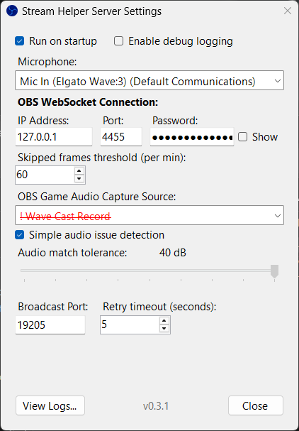
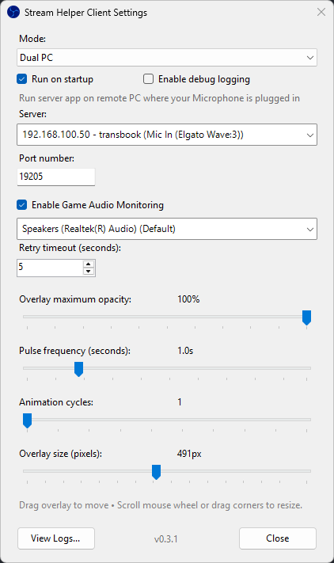
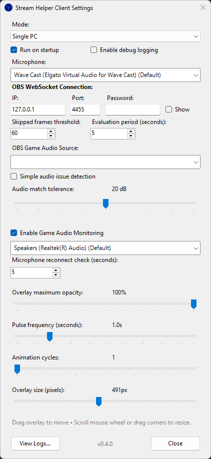
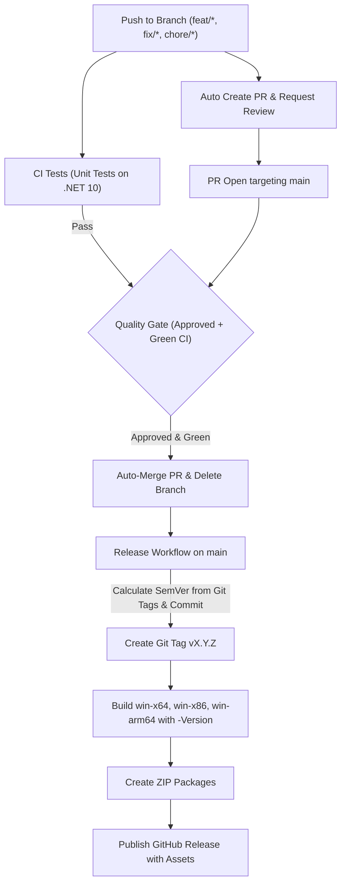

# Stream Helper

Streaming issues HUD.

A minimalistic, lightweight, portable client-server system tray application with extremely low resource consumption to indicate streaming issues with OBS Studio.

It is a fork and extension of the original [Mic Helper](https://github.com/mercdev-corp/mic-helper) application code and idea.

As a gameplay streamer, it is easy to miss critical stream-breaking issues while focused on your game — whether your microphone was left muted, game audio failed to capture, OBS dropped frames due to network or encoder lag, or OBS disconnected altogether. Stream Helper eliminates these surprises by providing an in-game HUD overlay and system tray indicators that immediately alert you to issues over your game window. Designed with a client-server architecture, it seamlessly supports dual-PC streaming setups as well as single-PC rigs.

Issues monitored and indicated in the HUD:
- OBS Studio execution & connection issues _(no response from OBS WebSocket server)_
- OBS Studio broadcast network issues _(dropped frames due to network congestion)_
- OBS Studio rendering & encoding issues _(dropped frames due to rendering lag or encoder overload)_
- Game audio capture issues _(audio playing in speakers/headphones differs from what is captured on the target channel in OBS Studio)_
- Microphone mute status _(audio input device mute status in OS)_

<p align="center">
  
</p>

## Getting Started

Download the latest release for your platform from the [Releases](https://github.com/mercdev-corp/stream-helper/releases) page. Unzip the archive into a dedicated folder (e.g. `C:\Tools\StreamHelper` or any preferred directory).

Run `StreamHelper.Server.exe` on the PC running OBS Studio (where your microphone is plugged in). Open settings to configure the OBS connection, select your desired microphone device, and choose the game audio capture source (change other options as needed).



Run `StreamHelper.Client.exe` on the gaming PC where you want to see HUD indications (and where game audio is playing). Open settings and select your server from the dropdown (change other options if needed). Drag, drop, and resize the overlay as needed.



Settings for each component will be saved in the same directory from where the application is executed.

In case of single PC used for play and stream - Client app can be switched to single PC mode and combine all features from both apps.



### Windows Defender & SmartScreen Notice ("Windows protected your PC")

When launching `StreamHelper.Server.exe` or `StreamHelper.Client.exe` for the first time after downloading from GitHub, Windows Defender SmartScreen may display a warning:

> **"Windows protected your PC"**  
> *Microsoft Defender SmartScreen prevented an unrecognized app from starting. Running this app might put your PC at risk.*

#### Why Does This Appear?
Stream Helper is an open-source project. Because releases are built directly via GitHub Actions without an expensive commercial Extended Validation (EV) code-signing certificate, Windows SmartScreen treats newly released binaries as "unrecognized" until enough users download them to establish a positive reputation. The application is 100% open source, contains no telemetry, adware, or malware, and all source code is publicly auditable in this repository.

#### How to Launch the Application
1. On the blue **Windows protected your PC** dialog, click the **More info** link.
2. Click the **Run anyway** button that appears.

> [!TIP]
> **Permanently Unblock Downloaded Files (Optional):**
> You can also unblock the files before extracting/running:
> - **Via File Explorer:** Right-click the downloaded `.zip` (or `.exe`) file &rarr; select **Properties** &rarr; at the bottom of the **General** tab check **Unblock** &rarr; click **Apply** / **OK**.
> - **Via PowerShell:**
>   ```powershell
>   Unblock-File -Path .\stream-helper-*.zip
>   # Or for extracted binaries:
>   Get-ChildItem -Path .\StreamHelper.*.exe | Unblock-File
>   ```

#### Where Does the App Go After Launching?
Stream Helper is a **background system tray application** designed for minimal overhead. When launched, **no standard desktop window appears**. Instead:
1. The application starts immediately in the **Windows System Tray / Notification Area** (near the clock in the bottom-right corner of your taskbar).
2. If you do not immediately see the blue OBS logo icon, click the **`^` (Show hidden icons)** chevron on your taskbar.
3. **Right-click the tray icon** to open **Settings**, **Pause/Resume**, or **Exit**.

## Architecture

.NET Windows desktop application with native single-file compilation.

### Server

Runs on the PC with OBS Studio (where the microphone is typically connected). Connects to the OBS Studio WebSocket server and monitors microphone mute status changes, broadcasting all status updates and alerts to connected clients. Receives game audio telemetry from the client and compares it with the target audio capture device in OBS Studio.

### Client

Runs on the gaming PC where game audio originates and where HUD indications are displayed. Subscribes to Server broadcast information and updates the system tray icon and in-game overlay accordingly. Captures and sends game audio telemetry to the Server for verification.

Supports both **Dual-PC mode** (listening to remote Server broadcasts and streaming audio telemetry over UDP) and **Single-PC mode** (running OBS monitoring, audio telemetry correlation, and microphone monitoring directly in-process without network overhead or requiring the Server executable to run).

# UI

System tray application on both server and client. As a system tray icon, it displays streaming issues, stream health, audio capture status, and microphone mute status, and provides a context menu with the following items:
- Pause/Resume
- Settings
- Exit

## Server application

The server application monitors OBS Studio, microphone mute status, and game audio capture, broadcasting all alerts and status changes to connected clients via UDP multicast and updating its tray icon accordingly.

### System Tray Statuses

The server-side system tray icon displays the following statuses and hover tooltips:

| Status Condition | Icon Asset | Hover Tooltip |
|---|---|---|
| **Active / Healthy** | `obs-logo-blue.png` | `Helper is active` |
| **Paused** | `pause.png` | `Helper is paused` |
| **OBS Disconnected** | `obs-disconnected.png` | `OBS is not running` |
| **OBS Reconnecting** | `obs-reconnect.png` | `OBS reconnecting` |
| **OBS Network Issue** | `obs-network-issue.png` | `OBS network issue` |
| **OBS Render/Encoding Issue** | `obs-render-issue.png` | `OBS render issue` |
| **Microphone Muted** | `mic-muted.png` | `Microphone muted` |
| **Microphone Disconnected** | `device-disconnected.png` | `Microphone disconnected` |
| **OBS Capture Device Disconnected** | `device-disconnected.png` | `OBS capture device disconnected` |
| **OBS Capture Device Muted** | `sound-muted.png` | `OBS capture device muted` |
| **OBS Sound Capture Issue** | `sound-issue.png` | `OBS sound capture issue` |

If more than one status is active at the same time, the system tray icon cycles through the active status icons once per second, and all active status descriptions are listed line-by-line in the tooltip on hover:

```text
Stream Helper - Issues detected:
• OBS network issue
• Microphone muted
• OBS capture device disconnected
```

### Menu

Using the context menu on the tray icon, you can perform the following actions:

#### Pause/Resume

Pauses and resumes information broadcasting. When paused, all connected clients are disconnected. The state is saved to settings and applied immediately.

#### Settings

Opens the settings dialog. Settings are saved and applied automatically upon modification and on server startup. If the dialog is closed, the application continues running in the tray. Settings are saved in the same directory as the application in `stream-helper-server-settings.json`.

Settings options:

##### Operational mode

Dropdown selector to switch between **Dual PC** and **Single PC** mode.
- **Dual PC mode:** Connects to a remote server broadcasting on the local network. Disables local OBS and mic monitoring engines to eliminate redundant resource consumption.
- **Single PC mode:** Runs OBS monitoring, audio correlation, and microphone monitoring directly in-process within the client application. Eliminates the need to run `StreamHelper.Server.exe` on single-PC streaming rigs and handles all telemetry in-memory with zero network overhead.

When switched to **Single PC mode**, the settings dialog dynamically presents the OBS connection settings (IP, port, password), skipped frames threshold, OBS audio capture device selector, Simple audio issue detection switch, Audio match tolerance slider, and microphone selection dropdown directly within the client settings window.

##### Run on startup

Enables or disables the application running on Windows startup.

Adds or removes the application from the Windows startup list. Status is determined by checking whether the application executable path exists in the startup list.

##### Microphone selection

Defaults to the system's default microphone on first run and saves it to settings.

Dropdown list of available microphones. Shows the configured microphone from settings as the current selection. Updates settings on selection change.

If the saved microphone is not found, it is shown as the first option in red strikethrough text, followed by all detected microphones in alphabetical order. If the selection is not changed manually, the missing device remains preserved in settings despite not being currently connected.

##### OBS connection

Fields to configure the OBS connection:
- OBS server IP address input field (default `127.0.0.1`)
- OBS server port integer input field (default `4455`)
- OBS password input field with a toggle button to reveal/hide password

Changes are saved and applied immediately.

##### Skipped frames threshold

Number input field to set the threshold of skipped frames (due to rendering lag, encoder overload, or network issues) per minute after which the corresponding alert status is broadcast. Alerts are calculated over a rolling 60-second delta (rather than cumulative totals) to prevent persistent alerts after recovery, and clear after staying below threshold for a 5-second cooldown period.

##### Game audio capture device selection

Dropdown list of available audio capture devices from OBS Studio. Shows the currently saved device from settings. Updates settings on selection change. If the selected device is currently unavailable in OBS or OBS is not running, it is shown as the first item with red strikethrough text, followed by all available devices. If not changed manually, it remains preserved in settings despite not being found.

##### Simple audio issue detection

Checkbox to toggle simplified game audio verification mode (default: disabled / unchecked).
- When enabled, Pearson cross-correlation analysis is skipped entirely, and audio monitoring relies exclusively on the conditional silence detector (alerting only when game audio is actively playing on the gaming PC while the OBS capture source remains silent).
- Disables the **Audio match tolerance** slider and displays it visually at maximum (`40 dB`).
- When unchecked / disabled, the user's previously configured tolerance value is automatically restored.
- Changes are applied live to the monitoring engine and persisted immediately to settings.

##### Audio match tolerance

Defaults to `20 dB` (adjustable between `0 dB` and `40 dB` in 5 dB increments).

Slider with a real-time dB label that sets the mean absolute RMS difference allowed between the gaming PC output and OBS capture at the best correlation lag. If Pearson correlation drops below threshold ($r < 0.5$) due to volume level offsets, compression, or downmixing, but the average volume difference remains within this tolerance, false alarms are prevented. A mismatch alert is only raised when correlation is low *and* volume difference exceeds this tolerance.

##### Retry timeout

Defaults to `5` seconds.

Integer input field to adjust retry timeout in seconds.

##### Server port number

Defaults to `19205`.

Integer input field to adjust the port number where the server broadcasts information. Changes are saved to settings and applied immediately.

The field displays in red if the port is already in use by another application, showing the tooltip `Port is already in use` on hover.

#### Exit

Exits the application.

### Behavior

If OBS is not running, the server broadcasts the `obs disconnected` status to connected clients (tray icon displays `obs-disconnected`, hover tooltip: `OBS is not running`).

The server checks for OBS availability periodically according to the retry timeout setting.

#### Paused state

When the server is in a paused state, it stops monitoring OBS and audio devices, disconnects all connected clients, and displays the `paused` status icon in the system tray (hover tooltip: `Helper is paused`).

#### Active state

When the server is active and no issues are detected with the OBS connection, stream health, audio capture, or microphone, it displays the default blue status icon in the system tray (hover tooltip: `Helper is active`).

##### Microphone status monitoring

The server monitors the selected microphone's status (subscribing to audio endpoint volume events or polling periodically) and broadcasts status updates to connected clients according to the following rules:
- The server checks the selected microphone's status when plugged in. If the microphone is not available, the server displays the `device disconnected` status icon in the system tray and broadcasts `device disconnected` to all connected clients until the device becomes available again. The server checks whether the microphone becomes available periodically according to the retry timeout setting (hover tooltip: `Microphone disconnected`).
- If the microphone is muted, the server broadcasts `mic muted` status to all connected clients and displays the `microphone muted` status icon in the system tray (hover tooltip: `Microphone muted`).

##### Game audio capture monitoring

The server monitors the audio capture status of the target device in OBS and broadcasts status updates to connected clients according to the following rules:
- If the audio capture device is not found in OBS (or not yet selected), the server displays the `device disconnected` status icon in the system tray and broadcasts `device disconnected` to all connected clients until the device becomes available. The server checks if the audio capture device becomes available periodically according to the retry timeout setting (hover tooltip: `OBS capture device disconnected`).
- If the audio capture device is found and muted, the server broadcasts `sound muted` status to all connected clients and displays the `sound muted` status icon in the system tray (hover tooltip: `OBS capture device muted`).

In addition to basic audio capture statuses, the server also monitors and compares an **RMS Envelope Correlation** between the game audio output and the audio captured by OBS:

> [!NOTE]
> **Alert Suppression:** If the microphone or audio capture device is disconnected or muted, algorithmic correlation anomaly alerts (`sound issue`) are suppressed to avoid redundant alarms.

1. **On the Gaming PC:** A lightweight background worker uses `WASAPI Loopback Capture` to monitor the default audio output device (or the dedicated audio interface assigned to the game). It computes RMS (root-mean-square volume in dBFS) and peak values in **100ms sub-sampling windows** (10 Hz). If the Gaming PC does not send this telemetry, the server treats it as silence on the client side and does not trigger false alerts.
2. **Network Transmission:** The worker batches these 100ms readings into a single compact UDP packet sent to the Server once per second: `[timestamp_ms, [rms_db_0, rms_db_1, ... rms_db_9]]`.
3. **On the OBS Side:** OBS WebSocket v5 natively provides the `InputVolumeMeters` event subscription (`EventSubscription::InputVolumeMeters`). OBS periodically emits current volume levels (peak and RMS) for each configured audio input without requiring custom audio capture plugins.
4. **Comparison & Anomaly Detection:**
  * **Conditional Silence Detector (covers ~95% of real-world failures):**
    * If the Gaming PC detects active audio (`RMS > -45 dBFS`) continuously for 3–5 seconds while the corresponding audio source in OBS remains below the ambient noise threshold (`RMS < -60 dBFS`) or is muted, the server broadcasts the `sound issue` status to all connected clients, sets the `sound issue` tray icon, and displays `OBS sound capture issue` on tray hover.
    * If the game itself is quiet (e.g., loading screens, pause menus, stealth sequences), the condition is not met, preventing false positives.
  * **Cross-Correlation & Audio Match Tolerance:**
    * To verify that the audio captured by OBS actually matches the game output, maintain a rolling time-series window (e.g., 10 seconds / 100 samples at 100ms resolution).
    * Calculate Pearson's correlation coefficient between the Gaming PC and OBS RMS series across an expected lag range (e.g., 0 to 500 ms in 100 ms steps), and evaluate the mean absolute RMS difference at the best lag.
    * If the audio on the Gaming PC exhibits significant dynamic variation (high RMS variance) while correlation remains low ($r < 0.5$) **and** the mean absolute difference exceeds the configured **Audio match tolerance** (default `20 dB`, range `0`–`40 dB`), the server broadcasts the `sound issue` status to all connected clients, sets the `sound issue` tray icon, and displays `OBS sound capture issue` on tray hover.
    * If **Simple audio issue detection** is enabled, Pearson cross-correlation is completely bypassed/reset, and anomaly detection relies solely on the Conditional Silence Detector.

##### OBS stats monitoring

The server periodically checks OBS status and stream health, broadcasting updates to all connected clients.

The server checks process health each second via the WebSocket connection. If OBS closes or crashes, all frame and reconnect alerts clear immediately, and the status transitions to `obs disconnected`.

Via `GetStreamStatus`, the server retrieves information about active streaming and recording. If an output is active, the server monitors and broadcasts:
- Increasing reconnection attempts: broadcasts `obs reconnecting` status to all connected clients, sets `obs reconnect` icon in the system tray, and displays `OBS reconnecting` tooltip on hover. Clears when reconnect succeeds or stream is stopped.
- Number of skipped frames due to network issues exceeds the rolling 60-second threshold: broadcasts `obs network issue` status to all connected clients, sets `obs network issue` icon in the system tray, and displays `OBS network issue` tooltip on hover. Clears after a 5-second cooldown below threshold or when streaming stops.

Via `GetStats`, the server retrieves information about skipped frames due to rendering lag or encoder overload. If the rolling 60-second rate exceeds the threshold, it broadcasts the `obs render issue` status to all connected clients, sets the `obs render issue` icon in the system tray, and displays `OBS render issue` tooltip on hover. Clears after a 5-second cooldown below threshold.

## Client application

Consumes stream status and alert broadcasts from the server (in Dual-PC mode) or directly from internal monitoring engines (in Single-PC mode), updating the transparent click-through overlay and system tray icon accordingly.

If `Game audio monitoring` is enabled, it uses `WASAPI Loopback Capture` to monitor the default audio output device (or the dedicated audio interface assigned to the game). It computes RMS (root-mean-square volume in dBFS) and peak values in 100ms sub-sampling windows and transmits them batched once per second over UDP to the Server: `[timestamp_ms, [rms_db_0, ... rms_db_9]]` (or feeds the local correlation engine directly in Single-PC mode).

### System Tray Statuses

The client-side system tray icon displays the following statuses and hover tooltips:

| Status Condition | Icon Asset | Hover Tooltip |
|---|---|---|
| **Active / Healthy** | `obs-logo-blue.png` | `Helper is active` |
| **Paused** | `pause.png` | `Helper is paused` |
| **Server Disconnected** | `server-disconnected.png` | `Server not found` *(Dual-PC only)* |
| **Microphone Muted** | `mic-muted.png` | `Microphone muted` |
| **Device Disconnected** | `device-disconnected.png` | `Microphone disconnected` / `OBS capture device disconnected` |
| **OBS Disconnected** | `obs-disconnected.png` | `OBS is not running` |
| **OBS Reconnecting** | `obs-reconnect.png` | `OBS reconnecting` |
| **OBS Network Issue** | `obs-network-issue.png` | `OBS network issue` |
| **OBS Render/Encoding Issue** | `obs-render-issue.png` | `OBS render issue` |
| **Game Audio Not Selected** | `sound-muted.png` | `Game audio not selected` *(Client local)* |
| **Game Audio Device Missing** | `sound-issue.png` | `Game audio not found` *(Client local)* |
| **OBS Capture Device Muted** | `sound-muted.png` | `OBS capture device muted` |
| **OBS Sound Capture Issue** | `sound-issue.png` | `OBS sound capture issue` |

If more than one status is active at the same time, the status icon in the system tray cycles through the active status icons once per second, and all active status descriptions are listed line-by-line in the tooltip on hover:

```text
Stream Helper - Issues detected:
• OBS network issue
• Microphone muted
• OBS capture device disconnected
```

### Menu

Using the context menu on the tray icon, you can perform the following actions:

#### Pause/Resume

Pauses and resumes consuming statuses from the server. State is saved to settings and applied immediately.

#### Settings

Opens the settings dialog as a movable window. Settings are saved and applied automatically upon modification and on client startup. If the dialog is closed, the application continues running in the tray. Settings are saved in the same directory as the application in `stream-helper-client-settings.json`.

When the settings dialog is opened, the overlay enters WYSIWYG edit mode (displaying a preview overlay, e.g., `microphone muted`) with a dashed outline, 4 corner resize handles, and a real-time size badge. Users can drag and drop the overlay to position it anywhere on screen, and resize it with a locked 1:1 aspect ratio using:
- **Mouse Wheel:** Scroll up/down anywhere over the overlay to smoothly enlarge or shrink it.
- **Corner Handles:** Click and drag any of the 4 corner handles (or bottom-right diagonal grip).
- **Settings Slider:** Directly adjust the **Overlay size** slider in the Settings dialog.

Each change to the overlay position (geometric center) and dimensions is saved and applied immediately. Resized versions of status images displayed by the overlay (such as `microphone muted`, `server disconnected`, OBS issues, audio capture alerts, etc.) are pre-rendered and cached to disk on save to ensure zero CPU/GPU overhead during runtime.

Settings options:

##### Run on startup

Enables or disables the application running on Windows startup.

Adds or removes the application from the Windows startup list. Status is determined by checking whether the application executable path exists in the startup list.

##### Port number

Defaults to `19205`.

Integer input field to adjust the port number where the server broadcasts statuses. Changes are saved to settings and applied immediately.

##### Server IP

Dropdown list of server IP addresses currently broadcasting on the local network on the selected port.

Defaults to the first available IP address from the list and saves it to settings.

If not selected or unavailable, the application displays the `server disconnected` status icon, shows the `Server not found` tooltip on hover, and will neither attempt to connect nor collect/send audio telemetry. Changes are saved to settings and applied immediately.

If the saved IP address is not found or accessible on the local network, it is shown as the first selected option in red strikethrough text, followed by other available server IP addresses in alphabetical order. If not changed manually, it remains preserved in settings despite not being detected on the network.

##### Game audio monitoring

Enables or disables monitoring and sending RMS (root-mean-square volume in dBFS) and peak values to the server.

##### Game audio output selection

Dropdown selector for the default audio output device or the dedicated audio interface assigned to the game.

Defaults to the system's default audio output device. Saved to settings and applied immediately on change. If not selected while `Game audio monitoring` is enabled, the application displays the `sound muted` status icon in the system tray and shows `Game audio not selected` tooltip on hover.

If the saved audio output is not found in the system, it is shown as the first selected option in red strikethrough text, followed by the system default audio output and other available sound outputs in alphabetical order. If the selection is not changed manually, it remains preserved in settings despite not being found in the system.

##### Retry timeout

Defaults to `5` seconds.

Integer input field to adjust retry timeout in seconds.

##### Overlay opacity

Defaults to `100`.

Slider to adjust maximum opacity of the overlay from `0` to `100`.

The overlay pulses from `0` to this setting and back to `0` according to the `Pulse frequency` setting.

##### Pulse frequency

Defaults to `1`.

Slider to adjust pulse animation period of the overlay from `0.1` to `5` seconds.

##### Animation cycles

Defaults to `1`.

Slider to select the number of pulse animation cycles to display each active status icon in the overlay before rotating to the next active alert (adjustable between `1` and `10` cycles).

##### Overlay size

Defaults to `128` pixels (adjustable from `32` to `1024` pixels).

Slider to adjust the width and height of the overlay with 1:1 aspect ratio preserved. Synchronized in real time with on-screen mouse wheel scrolling and corner dragging.

#### Exit

Exits the application.

### Behavior

When the client is in a paused state, it does not connect to the server, does not collect or send audio telemetry, and the overlay is hidden. It also displays the `paused` status icon in the system tray (hover tooltip: `Helper is paused`).

If the client is not in a paused state, it attempts to connect to the server and behaves according to the following rules:
- If the server is not available, the client displays the `server disconnected` status icon in the tray, shows `Server not found` tooltip on hover, and displays the pulsing `server disconnected` overlay at the configured position. The client attempts to reconnect according to the retry timeout setting.
- If the server is available, the client listens to incoming state changes and behaves accordingly:
  - Displays the default blue icon when no issues or alerts are active.
  - Displays the corresponding status icon and tooltip text for incoming statuses (matching the server) and displays the pulsing overlay icon at the configured position. If more than one status is active simultaneously, the overlay cycles through them according to the configured number of animation cycles (1 to 10 cycles, defaults to 1).
- If `Game audio monitoring` is enabled (if any of the following issues occur, the application stops collecting and transmitting audio data to the server):
  - If the audio output device is not configured: displays the `sound muted` icon in the system tray, shows `Game audio not selected` tooltip on hover, and displays the pulsing `sound muted` overlay icon.
  - If the configured audio output device is not found in the system: displays the `sound issue` icon in the system tray, shows `Game audio not found` tooltip on hover, and displays the pulsing `sound issue` overlay icon.

When displayed, the overlay is always click-through and renders on top of all other windows (including borderless and fullscreen games).

## Development

.NET 10 SDK is required to build the application.

> [!WARNING]
> The application must consume as few resources (CPU, memory, VRAM, GPU, network) as possible so as not to affect gaming performance, and must not be flagged as a cheat by anti-cheat software.

Run `dev_prepare.ps1` to install SDK and other dev requirements using winget.

Run `build_all.ps1` to install dependencies and build the application. It compiles standalone Server and Client executables for each target platform with `-c Release --self-contained true -p:IncludeNativeLibrariesForSelfExtract=true -p:PublishSingleFile=true -o ./bin` into the `bin` directory.

### Build Artifacts & Distribution

- **Standalone Executables:** The compiled `.exe` files (`StreamHelper.Server.exe` and `StreamHelper.Client.exe`) in `./bin` are fully self-contained, portable single-file binaries bundling all required .NET runtimes, libraries, and assets. They can be copied anywhere and executed with zero external dependencies.
- **`*.pdb` Files:** Any `*.pdb` (Program Database) files generated in `./bin` contain debug symbols used only for debugging and stack trace symbol resolution. They are **not required** for running or distributing the applications and can be safely deleted or omitted.

### Supported Platforms & Architectures

The build pipeline supports compiling for multiple Windows architectures via the `-Platforms` parameter:

| Architecture | Platform Target | Compatibility & Behavior |
|---|---|---|
| **64-bit Intel/AMD** | `win-x64` (default) | Standard 64-bit Windows PCs. Also runs on Windows 11 on ARM via built-in x64 emulation (Prism). |
| **32-bit Intel/AMD** | `win-x86` | Native 32-bit Windows systems. Executables compiled for `win-x64` cannot run on 32-bit OS and require this target. |
| **64-bit ARM** | `win-arm64` | Native execution for Qualcomm Snapdragon X Elite/Plus, Surface Pro ARM, and Windows on ARM devices with zero emulation overhead. |

> [!NOTE]
> Legacy 32-bit ARM (ARM32 / Windows RT) is deprecated by modern .NET and Windows and is not supported.

To compile for specific or multiple architectures simultaneously:

```powershell
# Default build: win-x64 only (outputs directly to ./bin)
.\build_all.ps1

# Native 32-bit build:
.\build_all.ps1 -Platforms @("win-x86")

# Native ARM64 build:
.\build_all.ps1 -Platforms @("win-arm64")

# Multi-platform build: outputs to ./bin/win-x64, ./bin/win-x86, and ./bin/win-arm64
.\build_all.ps1 -Platforms @("win-x64", "win-x86", "win-arm64")
```

### Windows Defender & Troubleshooting Permissions

When running `.\build_all.ps1` or executing unit tests locally on Windows, you may encounter:
- `System.UnauthorizedAccessException: Access to the path '...' is denied` during test execution (e.g., when creating `.tmp` or `TestResults` deployment folders).
- Windows Defender SmartScreen prompts blocking freshly compiled unsigned binaries (`StreamHelper.Server.exe` or `StreamHelper.Client.exe`).

#### Root Cause
1. **Windows Defender Controlled Folder Access (Ransomware Protection):** By default, Windows Defender protects personal user directories (such as `C:\Users\<username>\...`). When the native test runner (`StreamHelper.Tests.exe`) or compiler executes, Defender blocks unsigned executables from creating or writing files within user profile folders.
2. **Real-Time Antivirus Minifilter Driver Locks:** The Windows Defender real-time scanning filter driver (`WdFilter.sys`) actively inspects newly emitted binaries and temporary test directories during rapid parallel test execution, occasionally creating transient file locks resulting in `Access is denied`.

#### Solutions

1. **Relocate the Project to a Dedicated Drive or Root Folder (Recommended):**
   - Clone or move the repository outside protected user directories (e.g. `E:\projects\stream-helper` or `C:\projects\stream-helper` instead of `C:\Users\<username>\...`). This bypasses Controlled Folder Access restrictions entirely without weakening system security.
2. **Add a Windows Defender Folder Exclusion:**
   - If keeping the repository within `C:\Users\<username>\...`:
     1. Open **Windows Security** → **Virus & threat protection**.
     2. Under **Virus & threat protection settings**, click **Manage settings**.
     3. Under **Exclusions**, click **Add or remove exclusions** → **Add an exclusion** → **Folder**.
     4. Select the project repository root folder.
3. **Allow `dotnet.exe` Through Controlled Folder Access:**
   - Under **Windows Security** → **Virus & threat protection** → **Manage ransomware protection** → **Allow an app through Controlled folder access**, add `dotnet.exe`.
4. **Enable Developer Mode:**
   - Open **Windows Settings** (`Win + I`) → **System** → **For developers** and toggle **Developer Mode** on to grant developer file-system permissions and symlink creation rights.

## GitHub Automation & Versioning

The project features a fully automated CI/CD pipeline using GitHub Actions, managing everything from pull requests to automated version bumping, testing, and multi-architecture releases.

### Versioning Strategy

Version management follows [Semantic Versioning (SemVer)](https://semver.org/) and is fully automated via Git tags:

- **Git Tags as Single Source of Truth:** Release versions are defined by Git tags (e.g. `v0.2.0`). No static version files are committed to the repository, avoiding merge conflicts and race conditions when parallel branches are developed and merged.
- **Dynamic MSBuild Injection:** [`Directory.Build.props`](Directory.Build.props) accepts `$(Version)` or `$(APP_VERSION)` passed from CI pipelines and [`build_all.ps1`](build_all.ps1) (falling back to `git describe --tags` or `0.1.0` during local development). It automatically applies versions to `Version`, `AssemblyVersion`, `FileVersion`, and `InformationalVersion` across all solution projects (`StreamHelper.Shared`, `StreamHelper.Server`, `StreamHelper.Client`, `StreamHelper.Tests`).
- **UI Version Display:** The resolved version is exposed dynamically at runtime and displayed in the context menu header of both Server and Client tray applications.

### Automated Workflows

The development lifecycle is orchestrated by four interconnected GitHub Actions workflows:


```mermaid
flowchart TD
    A["Push to Branch (feat/*, fix/*, chore/*)"] --> B["Auto Create PR & Request Review"]
    A --> C["CI Tests (Unit Tests on .NET 10)"]
    B --> D["PR Open targeting main"]
    C -->|Pass| E{"Quality Gate (Approved + Green CI)"}
    D --> E
    E -->|Approved & Green| F["Auto-Merge PR & Delete Branch"]
    F --> G["Release Workflow on main"]
    G -->|Calculate SemVer from Git Tags & Commit| H["Create Git Tag vX.Y.Z"]
    H --> I["Build win-x64, win-x86, win-arm64 with -Version"]
    I --> J["Create ZIP Packages"]
    J --> K["Publish GitHub Release with Assets"]
```

#### 1. Auto Create Pull Request (`auto-pr.yml`)
- Triggered automatically whenever changes are pushed to feature or maintenance branches (`feat/**`, `fix/**`, `chore/**`, `refactor/**`, etc.).
- Checks if an open PR targeting `main` already exists; creates a new Pull Request if none exists.
- Automatically assigns the repository owner / admin collaborator as a reviewer.

#### 2. Continuous Integration (`ci.yml`)
- Runs on all pull requests targeting `main` and pushes to development branches.
- Restores dependencies and executes the unit test suite on a Windows runner using the .NET 10 SDK.

#### 3. Quality Gate & Auto-Merge (`auto-merge.yml`)
- Triggered by pull request review submissions, CI workflow completions, or manual workflow dispatch.
- Evaluates candidate pull requests against strict quality gates:
  - Pull Request must target `main`.
  - PR must have an **APPROVED** review status from an authorized collaborator or repo owner.
  - All CI status checks must be completed and successful (with automatic polling wait).
- Merges the PR cleanly into `main` and deletes the feature branch.

#### 4. Build & Release Pipeline (`release.yml`)
- Triggered on direct pushes to `main` (following an automated PR merge), git tags matching `v*`, or manual dispatch.
- **Automated SemVer Calculation:**
  - Queries the latest Git tag on `main` (e.g. `v0.1.0`).
  - Analyzes the merge commit message:
    - `BREAKING CHANGE` or `!:` triggers a **Major** bump (`0.1.0` &rarr; `1.0.0`).
    - `feat/` branch or `feat:` commit triggers a **Minor** bump (`0.1.0` &rarr; `0.2.0`).
    - `fix/`, `chore/`, `ci/`, or other maintenance commits trigger a **Patch** bump (`0.1.0` &rarr; `0.1.1`).
- Creates and pushes the new annotated Git tag to origin (skipping if tag already exists).
- Compiles standalone self-contained binaries for all supported Windows platforms with the calculated version:
  - `win-x64` (64-bit Intel/AMD)
  - `win-x86` (32-bit Intel/AMD)
  - `win-arm64` (64-bit ARM)
- Packages the Server and Client executables for each architecture into zip archives (`stream-helper-<version>-win-x64.zip`, `stream-helper-<version>-win-x86.zip`, `stream-helper-<version>-win-arm64.zip`).
- Publishes a new GitHub Release with attached zip packages and auto-generated release notes.

## License

Licensed under the [Apache License, Version 2.0](LICENSE).
Copyright (c) 2026 Vadim Lopatiuk.
